<!-- ╔══════════════════════════════════════════════════════════════╗ -->
<!--                          STICKMAN.EXE                            -->
<!-- ╚══════════════════════════════════════════════════════════════╝ -->

<div align="center">


<a href="https://github.com/HouseGram-code/stickman.exe">
  
</a>

<br/>

<!-- ░░ БЕЙДЖИ ░░ -->


<br/>


</div>

<div align="center">

```
       ████████████████████████████████████████████████████
       █                                                  █
       █     " Прекрасный день → прогулка направо →        █
       █       всё темнеет → появляется кровь →            █
       █       чёрный стикмен → глаза краснеют → Привет. "  █
       █                                                  █
       ████████████████████████████████████████████████████
```

</div>

---

## 🩸 О проекте

> **STICKMAN.EXE** — фанатская хоррор-игра в духе `.exe`-крипипаст, написанная на **Phaser 3 + TypeScript**.
> Начинается всё как милая прогулка под весёлую музыку... но мир постепенно тонет в темноте и крови.
> Ты не убегаешь от монстра. Ты идёшь к нему **сам**.

<div align="center">

</div>

---

## 👁 Особенности

| | |
|---|---|
| 🎭 **Резкая смена тона** | Светлый «счастливый» старт → медленное погружение в хоррор |
| 🩸 **Атмосфера** | Кровь, темнота, хоррор-дрон, сердцебиение и джампскейр |
| 🗣 **Диалоговая система** | Кат-сцены с портретами героя и злодея |
| 🏃 **Несколько режимов** | Прогулка, погоня, босс-битва и бесконечный раннер |
| 🕹 **Выбор персонажа** | Отдельная сцена выбора героя |
| 📱 **Мобильное управление** | Сенсорные кнопки + мультитач (движение и прыжок одновременно) |
| 🎨 **Полностью свои ассеты** | Все спрайты и звуки сгенерированы и заменяемы |

---

## 🎬 Сцены игры

```mermaid
flowchart LR
    A[🥾 Boot] --> B[📜 Menu]
    B --> C[🧍 Character Select]
    C --> D[🌳 Game / Прогулка]
    D --> E[🏃 Chase / Погоня]
    E --> F[⚔️ Battle / Босс]
    F --> G[♾️ Runner]
    style A fill:#000,stroke:#ff0000,color:#ff4d4d
    style B fill:#000,stroke:#ff0000,color:#ff4d4d
    style C fill:#000,stroke:#ff0000,color:#ff4d4d
    style D fill:#1a0000,stroke:#ff0000,color:#ff6666
    style E fill:#330000,stroke:#ff0000,color:#ff6666
    style F fill:#4d0000,stroke:#ff0000,color:#ff8080
    style G fill:#660000,stroke:#ff0000,color:#ffaaaa
```



---

## 🕹 Управление

| Действие | Клавиатура | Мобильные |
|----------|-----------|-----------|
| Движение | `← →` стрелки | сенсорные кнопки |
| Прыжок | `Пробел` / `↑` | кнопка прыжка |
| Пролистать диалог | `Пробел` / `Enter` | тап по экрану |
| Полный экран | `F` | — |

---

## ⚙️ Запуск

```bash
# 1. Установить зависимости
npm install

# 2. Запустить дев-сервер
npm run dev
```

Открой адрес, который покажет Vite (обычно `http://localhost:5173`).

### 🏗 Сборка для сайта

```bash
npm run build
```

Готовая версия появится в папке `dist/` — её можно залить на любой хостинг (GitHub Pages, itch.io, Netlify).

---

## 📁 Структура

```
stickman.exe/
├── assets/              # спрайты и звуки (заменяемые)
├── src/
│   ├── main.ts          # конфиг Phaser и список сцен
│   ├── scenes/          # Boot, Menu, CharacterSelect, Game, Chase, Battle, Runner
│   └── ui/              # Dialog, TouchControls
├── index.html
└── vite.config.ts
```

---

## 🗺 Роадмап / Улучшения

- [x] Базовый цикл: прогулка → хоррор → диалог
- [x] Мобильное управление и мультитач
- [x] Босс-битва и режим раннера
- [ ] 🔊 Регулятор громкости и меню настроек
- [ ] 💾 Сохранение прогресса и достижения
- [ ] 🌐 Полная локализация (RU / EN)
- [ ] 🎞 Больше кат-сцен и развязка сюжета
- [ ] 🏆 Таблица рекордов в режиме раннера
- [ ] 🕹 Поддержка геймпада

---

## ⚠️ Дисклеймер

> Это **некоммерческий фанатский проект**, созданный из любви к жанру `.exe`-хоррора.
> Все ассеты оригинальные/сгенерированы. Не связан с какими-либо правообладателями.

---

<div align="center">


**Сделано фанатами. Включи звук. Не оборачивайся.**

<sub>🩸 STICKMAN.EXE — v0.1 beta 🩸</sub>

</div>
